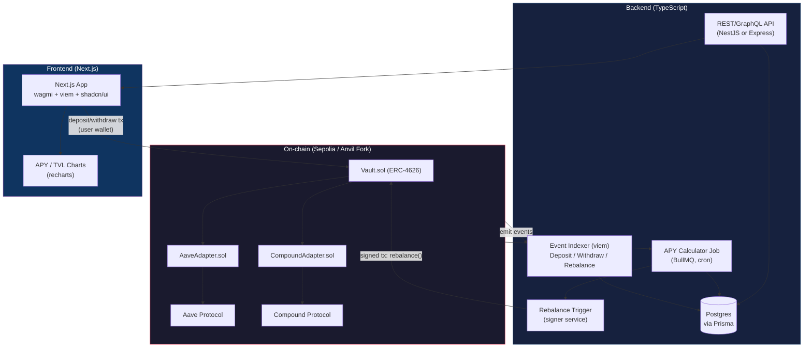

# DeFi Automated Yield Vault — Architecture & Roadmap

Portofolio project: vault ERC-4626 yang mengalokasikan dana user secara otomatis ke beberapa protokol lending (Aave, Compound) berdasarkan APY real-time.

**Stack:** Solidity + Foundry (contract) · Node.js/TypeScript + viem + BullMQ + Prisma/Postgres (backend) · Next.js + wagmi + shadcn/ui (frontend)

---

## 1. Architecture Diagram

**Alur singkat:**
1. User deposit lewat frontend → tx langsung ke `Vault.sol` (bukan lewat backend — ini penting untuk non-custodial).
2. `Indexer` mendengarkan event on-chain, sinkronkan state ke Postgres, termasuk handle reorg.
3. `Worker` secara periodik menghitung APY real dari tiap protokol (bukan APY yang di-cache dari API pihak ketiga — ini poin yang menunjukkan effort teknis nyata).
4. Kalau selisih APY antar protokol melewati threshold (misal >1.5%), `Rebalancer` mengirim transaksi `rebalance()` yang ditandatangani oleh signer service (bisa multisig atau EOA dengan private key terenkripsi, tergantung skala keamanan yang mau ditunjukkan).
5. `API` menyajikan data historis (APY, TVL, posisi user) ke frontend — bukan langsung query on-chain tiap request, supaya UI responsif.

---

## 2. Komponen & Tanggung Jawab

| Komponen | Tanggung jawab | Kenapa penting untuk portofolio |
|---|---|---|
| `Vault.sol` | Terima deposit/withdraw, terbitkan shares (ERC-4626) | Standar dikenal industri, mudah direview |
| `*Adapter.sol` | Interface seragam ke tiap protokol lending | Menunjukkan pemahaman komposisi protokol, bukan reinvent |
| Indexer | Sinkronisasi event on-chain → DB, reorg-safe | Backend logic yang genuinely dibutuhkan |
| APY Worker | Hitung yield real dari on-chain state | Bukan sekadar tampil data, tapi ada computation |
| Rebalancer | Eksekusi keputusan otomatis dengan aman | Menunjukkan penanganan transaksi produksi (nonce, gas, retry) |
| API | Serve data agregat & historis | Memisahkan concern read-heavy dari on-chain read |

---

## 3. Jadwal Iterasi (8 Minggu, Part-Time)

Asumsi: ~10–15 jam/minggu. Sesuaikan kecepatan sesuai kapasitas, tapi urutan fase sebaiknya tetap — tiap fase punya *checkpoint kritis* yang harus lolos sebelum lanjut, supaya tidak numpuk technical debt di akhir.

### Sprint 1 (Minggu 1–2): Smart Contract Core
- [ ] Setup Foundry project, struktur repo
- [ ] Implementasi `Vault.sol` (ERC-4626 dasar, deposit/withdraw)
- [ ] Unit test dasar (deposit, withdraw, share calculation)
- **Checkpoint kritis:** invariant test — total assets tidak pernah lebih kecil dari total shares value. Jangan lanjut ke Sprint 2 sebelum ini lolos, karena bug di sini akan menular ke semua fitur lain.

### Sprint 2 (Minggu 3): Strategy Adapters
- [ ] `AaveAdapter.sol` dan `CompoundAdapter.sol` dengan interface seragam (`IStrategyAdapter`)
- [ ] Test terhadap fork mainnet (Foundry `--fork-url`), bukan mock — supaya interaksi dengan protokol nyata teruji
- [ ] Access control (Ownable/AccessControl) + pausable
- **Checkpoint kritis:** fuzz test untuk skenario rebalance — pastikan tidak ada value yang hilang saat pindah antar adapter.

### Sprint 3 (Minggu 4): Backend — Indexer
- [ ] Setup NestJS/Express + Prisma + Postgres
- [ ] Indexer pakai `viem` — listen event, tulis ke DB
- [ ] Handle reorg (buffer beberapa block sebelum dianggap final)
- **Checkpoint kritis:** matikan-nyalakan indexer di tengah proses, pastikan tidak ada event yang hilang atau dobel (idempotency).

### Sprint 4 (Minggu 5): Backend — APY Worker & Rebalancer
- [ ] Job scheduler (BullMQ) hitung APY tiap protokol dari on-chain data
- [ ] Logic threshold untuk trigger rebalance
- [ ] Signer service (testnet key, jangan pernah commit private key — pakai env/secret manager)
- **Checkpoint kritis:** simulasi kegagalan tx (gas price melonjak, tx pending lama) — pastikan ada retry/backoff, bukan tx yang hilang begitu saja.

### Sprint 5 (Minggu 6): API Layer
- [ ] Endpoint: TVL historis, APY historis, posisi user, event log
- [ ] Rate limiting dasar, validasi input
- **Checkpoint kritis:** load test ringan — pastikan endpoint tidak collapse saat query historis besar (index DB dengan benar).

### Sprint 6 (Minggu 7): Frontend — Next.js
- [ ] Setup Next.js + wagmi + shadcn/ui
- [ ] Halaman: connect wallet, deposit/withdraw form, dashboard posisi user
- [ ] Chart APY/TVL (recharts) dari data API
- **Checkpoint kritis:** test dengan wallet yang benar-benar berbeda state (belum approve, sudah approve, saldo nol) — banyak portofolio gagal di edge case approval flow ini.

### Sprint 7 (Minggu 8): Integrasi, Deploy, Dokumentasi
- [ ] Deploy contract ke Sepolia testnet
- [ ] Deploy backend (Railway/Render) + frontend (Vercel)
- [ ] README lengkap: arsitektur, cara run lokal, demo link, penjelasan trade-off desain
- **Checkpoint kritis:** orang lain (bukan lo) coba clone & jalankan dari README — kalau mereka stuck, README belum selesai.

### Opsional (Minggu 9+, kalau ada waktu lebih)
- [ ] Audit checklist manual (Slither static analysis)
- [ ] Multisig untuk admin function, bukan single EOA
- [ ] Subgraph sebagai backup indexer (menunjukkan lo paham trade-off custom indexer vs The Graph)

---

## 4. Hal yang Perlu Diwaspadai

- **Jangan taruh dana real di mainnet** tanpa audit profesional — untuk portofolio, testnet atau mainnet fork sudah cukup untuk menunjukkan kemampuan teknis tanpa risiko finansial nyata.
- **Private key signer service** jangan pernah di-hardcode atau commit ke repo, meskipun testnet — kebiasaan ini yang dinilai reviewer berpengalaman.
- **Jangan skip invariant/fuzz test** demi ngejar deadline sprint — kontrak tanpa test jenis ini justru jadi red flag, bukan sekadar "kurang lengkap".
- Kalau di tengah jalan Sprint 1–2 terasa terlalu berat (reinvent adapter dari nol untuk 2 protokol sekaligus), **potong scope ke 1 protokol dulu** (misal Aave saja) dan selesaikan end-to-end, baru tambah Compound belakangan. Vertical slice yang selesai > horizontal scope yang setengah jadi.
